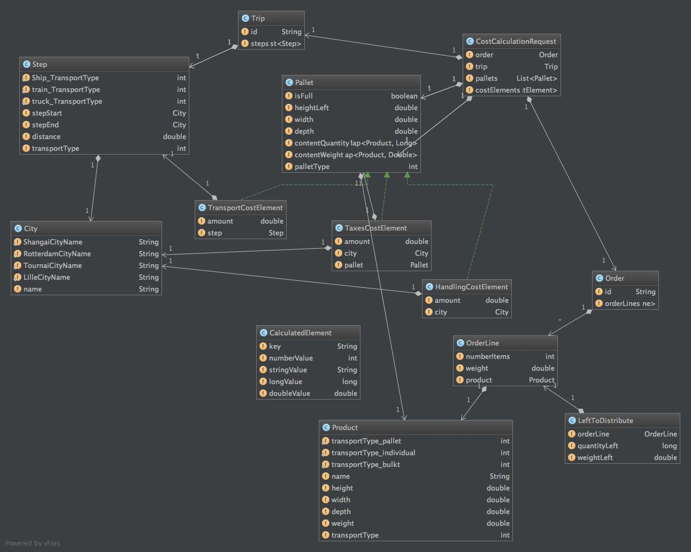

# Cost Calculation Data model

The first thing to do when using drools is to build the java class model on which the rules will apply.

* CostCalculationRequest
This is the top entity that will contain the trip description as well as the order the customer did and witch trip has to be calculated.
And in the same object, we shall put the final result in a list of costs and the complete list of pallets where we will put the products.
* Trip
Contains the list of steps of the trip.
* Step
A step happens between two cities and a unique transport type : train, truck or boat
* City
A city which can ne a harbour, a train station or a a final destination by truck.
* Order
The detail of the customer order.
* OrderLine
It contains the product as well as the number of items.
* LeftToDistribute
As we have to distribute all products in the pallets, we shall store here during the distribution what is left to be distributed.
* Product
The product that is bought and has to be in the transport.
* Pallet
Here is a picture of a pallet.

* HandlingCostElement, TaxesCostElement and TransportCostElement
they represent the different costs that we have to calculate.

* CalculatedElement
We shall use this class to store intermediate values.

